<picture>
  <source media="(prefers-color-scheme: dark)" srcset="dark.svg">
  <source media="(prefers-color-scheme: light)" srcset="light.svg">
  
</picture>

  

  
  

 

  <picture>
    <source media="(prefers-color-scheme: dark)" srcset="https://raw.githubusercontent.com/S3scobar/S3scobar/output/github-contribution-grid-snake-dark.svg">
    <source media="(prefers-color-scheme: light)" srcset="https://raw.githubusercontent.com/S3scobar/S3scobar/output/github-contribution-grid-snake.svg">
    
  </picture>

  

   &nbsp;&nbsp;
   &nbsp;&nbsp;
  

